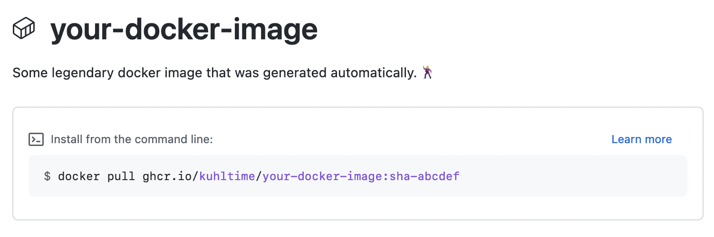

# GHCR-Action

An opinionated workflow to build and upload your docker image to the GitHub Container Registry.



## Example

```yaml
name: Build Docker Image

on: push

# Required for secrets.GITHUB_TOKEN
permissions:
  packages: write
  contents: read

jobs:
  docker:
    runs-on: ubuntu-latest
    steps:
      - name: GHCR-Action
        uses: KuhlTime/ghcr-action@v0.1.0
        with:
          token: ${{ secrets.GITHUB_TOKEN }}

```